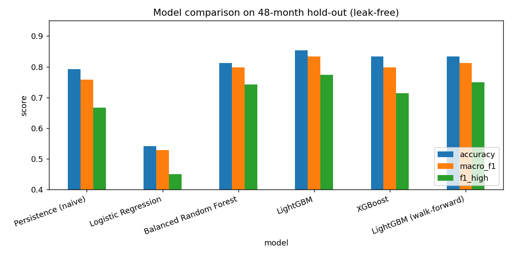

# USD/TRY Volatility-Regime Classification

Predicting whether the **next month** of USD/TRY will be a *high-* or *low-volatility*
regime, using machine learning on 19 years of daily exchange-rate data (2006–2024) plus
macro-financial context.

## Results (48-month out-of-sample hold-out)

| Model | Accuracy | Macro-F1 | High-vol F1 | ROC-AUC |
|---|---|---|---|---|
| Persistence (naive benchmark) | 0.792 | 0.758 | 0.667 | – |
| Logistic Regression | 0.542 | 0.529 | 0.450 | 0.634 |
| Balanced Random Forest | 0.812 | 0.798 | 0.743 | 0.873 |
| XGBoost | 0.833 | 0.798 | 0.714 | 0.885 |
| **LightGBM** | **0.854** | **0.833** | **0.774** | **0.899** |

LightGBM beats the persistence benchmark and a walk-forward backtest confirms it
(0.833 accuracy, 0.903 ROC-AUC). The decision threshold is chosen on validation folds, never
on the test set, so the numbers are genuinely out-of-sample.



## How it works

- **Label:** a month is *high-volatility* if its annualized daily-return volatility
  (`std × √252 × 100`) is ≥ 10%, else *low* (≈50/50 split).
- **38 features:** lagged/rolling/EWMA volatility, return moments (skew, kurtosis, max/min,
  autocorrelation), technical indicators (RSI, MACD, MA-gap), and macro variables
  (VIX, CPI, Brent oil, current account, FX & gold reserves, ECSU uncertainty index).
- **Evaluation:** time-series CV for tuning → threshold fixed on out-of-fold validation →
  single 48-month hold-out test → expanding-window walk-forward backtest.

## Run it

```bash
pip install -r requirements.txt
python improved_pipeline.py
```

Outputs go to `results/` (metrics CSV + figures).

## Repo structure

```
improved_pipeline.py   # end-to-end, leak-free pipeline (run this)
paper.md               # concise write-up
paper_detailed.md      # full report: methodology, features, results, discussion
data/                  # USD_TRY.xlsx (daily) + monthly.csv (aligned macro)
tcmb_data/             # raw CBRT / TÜİK macro sources
results/               # generated metrics and figures
```

## Documentation

- **[paper.md](paper.md)** — concise paper.
- **[paper_detailed.md](paper_detailed.md)** — long, detailed report.
